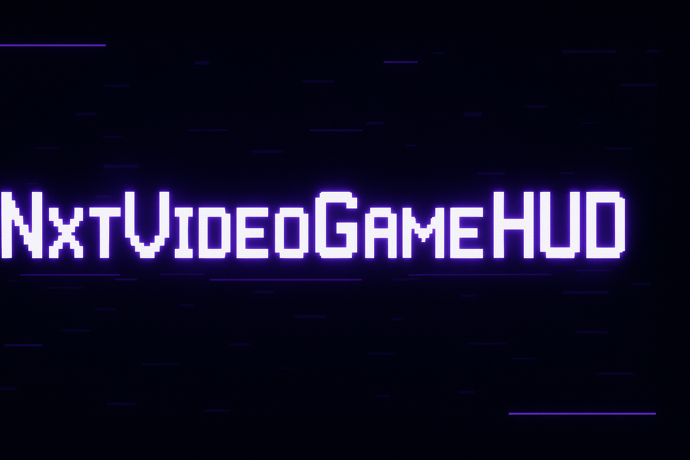
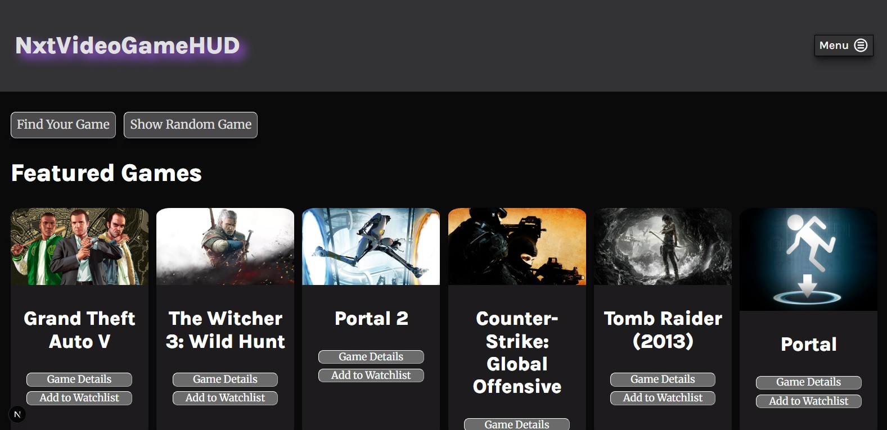
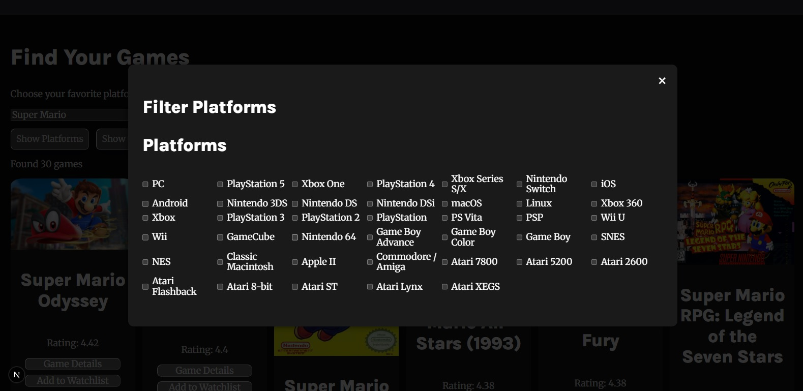
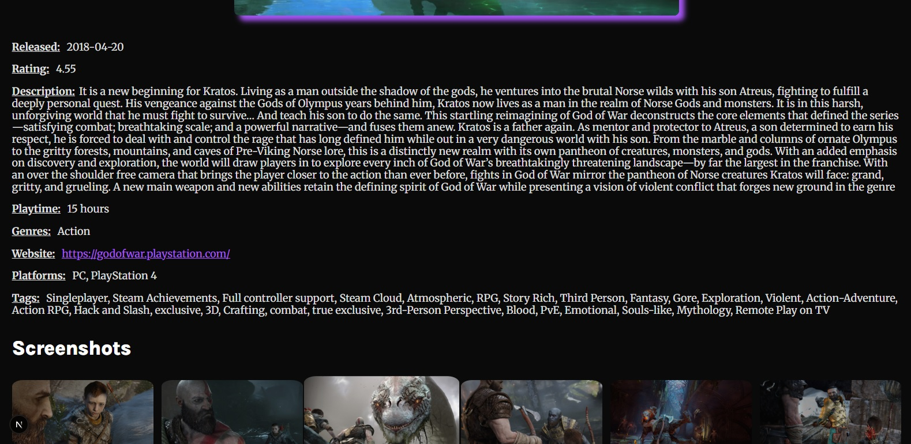
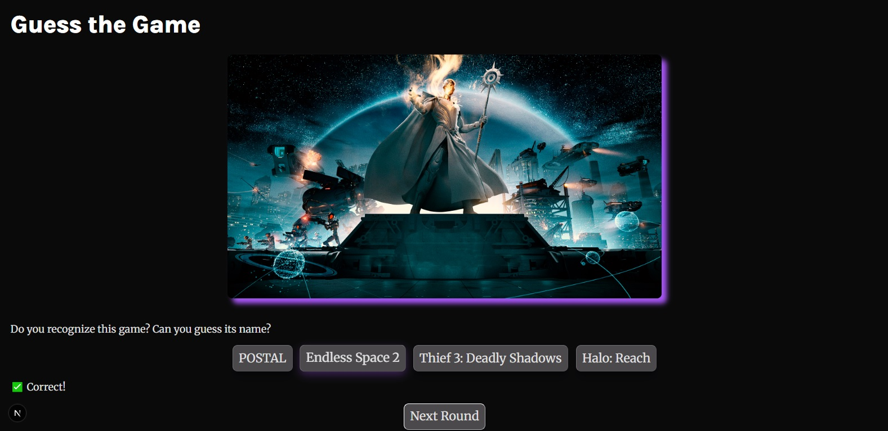
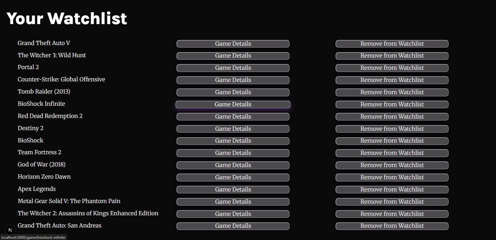

## 📑 Table of Contents
- [Short Description](#short-description)
- [Showcase](#showcase)
- [Key Features](#key-features)
- [Technologies Used](#technologies-used)
- [Challenges & Lessons Learned](#challenges--lessons-learned)
- [How to Get Started (Local Setup)](#how-to-get-started-local-setup)
- [Live Demo](#live-demo)
- [Data Source](#data-source)
- [Notes](#notes)

---

## Short Description
**NXT VideoGame HUD** is a modern web application for exploring and discovering video games.  
Built with **Next.js, React, and TypeScript**, it allows users to search, filter, and view detailed information about games pulled in real time from the RAWG API.  

Find your next favorite title, manage a personal watchlist, or play a fun **Guess the Game** minigame to test your knowledge.

---

## Showcase

### Screenshots
<p align="center">
  
</p>
<p align="center">
  
</p>
<p align="center">
  
</p>
<p align="center">
  
</p>
<p align="center">
  
</p>

### GIF Demo


### YouTube Demo Video
[Watch the Demo on YouTube](https://youtu.be/KeWtjcnb-no)

---

## Key Features
- **Highlighted Games:** Featured games displayed on the homepage.
- **Search & Filter:** Find games by title, platform, genre, or tags.
- **Game Details:** Each game has its own dedicated page pulling real-time data from the API.
- **Watchlist:** Save games to a personal watchlist stored in localStorage, with the ability to remove entries.
- **Random Game Selector:** Discover a random game at the click of a button.
- **Game of the Day:** A game that automatically updates every 24 hours.
- **Guess the Game Minigame:** A fun quiz where users guess the game from a screenshot and multiple-choice answers.
- **User-Friendly Interface:** Clean design with responsive layouts for an engaging browsing experience.

---

## Technologies Used
- **Framework:** Next.js  
- **Frontend:** React, TypeScript, HTML, CSS  
- **State Management:** React Hooks (useState, useEffect, useContext)  
- **Styling:** CSS Modules  
- **Data Source:** RAWG API  

---

## Challenges & Lessons Learned
- **Next.js & TypeScript Integration:** Gained hands-on experience building a TypeScript-powered Next.js project.  
- **API Handling:** Learned how to fetch, filter, and dynamically render data from a third-party gaming API.  
- **Local Storage Management:** Implemented persistent storage for the watchlist across sessions.  
- **Game Logic:** Built interactive features like the “Guess the Game” quiz and random game generator.  
- **Component Reusability:** Designed game detail pages with a consistent layout, reusing components effectively.  
- **Responsiveness:** The app is not yet fully responsive, as the main focus during development was on functionality rather than layout and design.

---

## How to Get Started (Local Setup)
To run this project locally, follow these steps:

1. Clone the repository:  
   ```bash
   git clone https://github.com/MarcelFelder-git/nxt-videogame-hud

2. Navigate to the project directory:
   ```bash
   cd nxt-videogame-hud
   ````

3. Install dependencies:
   ```bash
   npm i
   ````
   
4. Start the application:
   ```bash
   npm run dev
   ````

---

## Live Demo 
You can try out the live version of NXT VideoGame HUD here:
[NXT VideoGame HUD on Vercel](https://02-nxt-videogame-hud.vercel.app)

---

## Data Source
Games data is fetched from the [RAWG Video Games Database API](https://rawg.io/apidocs),
which provides access to thousands of games, platforms, and genres.
Special thanks to RAWG for making this data publicly accessible.

---

## Notes
This project was created as part of my **Frontend Developer training at Cimdata**.  
The main focus was on functionality, API integration, and TypeScript with Next.js.
Responsiveness and advanced design will be refined in future updates.
